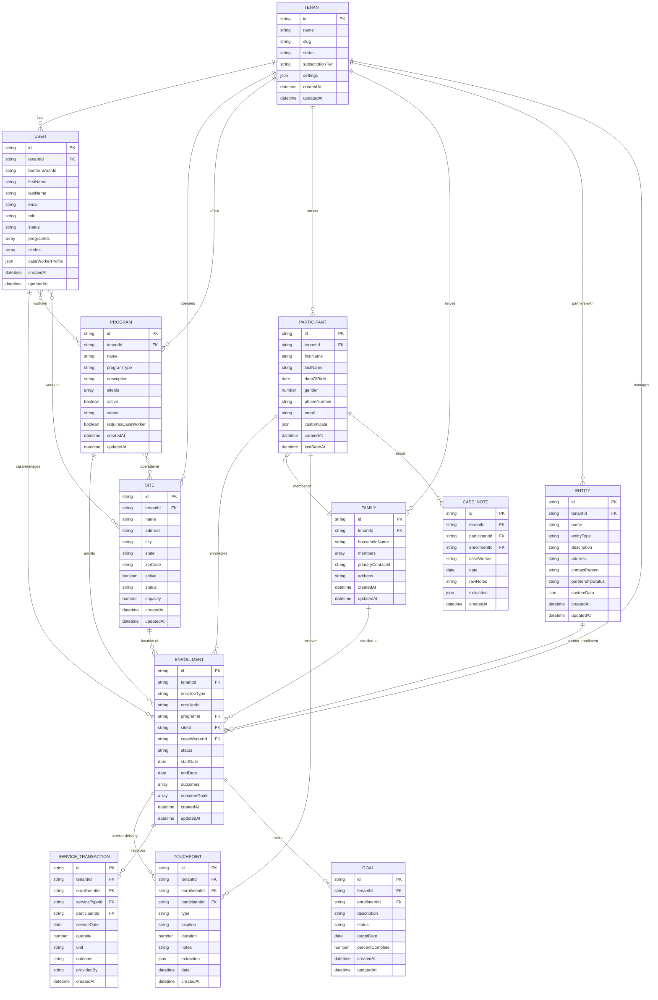
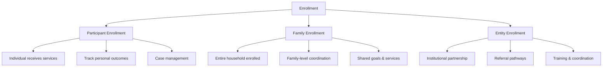
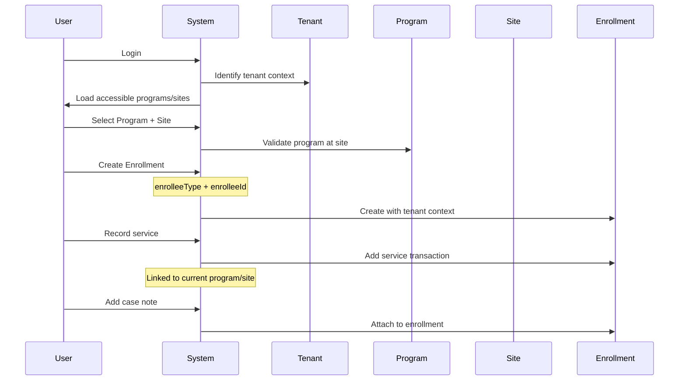
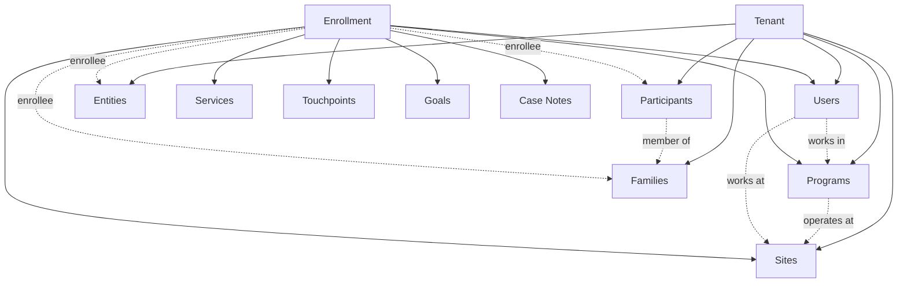

# Bonterra Outcomes Data Model

## Entity Relationship Diagram



## Key Concepts

### Multi-Tenancy
All data is scoped to a **Tenant** (organization). Each tenant is a completely isolated database instance representing a single client organization (e.g., "Seattle Housing Coalition").

### Generic Enrollments
Enrollments are **polymorphic** and can enroll three types of entities:

1. **Participant** (individual) - `enrolleeType: 'participant'`
2. **Family** (household) - `enrolleeType: 'family'`
3. **Entity** (institution) - `enrolleeType: 'entity'`

This allows for:
- Individual case management
- Family-level services (coordinated household support)
- Institutional partnerships (schools, employers, healthcare providers)

### Program-Site Relationship
Programs can operate across **multiple sites**:
- `Program.siteIds[]` defines which sites offer this program
- Empty array = program available at all sites
- Enrollments record the specific `siteId` where services are delivered

### User Access Control
Users have granular access control:
- `User.programIds[]` - which programs they can access (empty = all)
- `User.siteIds[]` - which sites they can access (empty = all)
- Super admins have `tenantId: 'SYSTEM'` and can access all tenants

## Enrollment Types



## Data Flow



## Hierarchy



## Entity Types

### Participants
Individual people receiving services. Core demographic data with flexible `customData` for tenant-specific fields.

### Families (Households)
Groups of participants living together. Enables:
- Family-level enrollments
- Coordinated case management
- Household relationship tracking

### Entities (Institutions)
Organizations that partner with programs:
- **Schools** - Educational partnerships
- **Employers** - Job placement partners
- **Healthcare Providers** - Medical/mental health coordination
- **Housing Authorities** - Housing voucher coordination
- **Government Agencies** - Social services coordination
- **Nonprofits** - Community partnerships

### Programs
Service programs with defined outcomes and eligibility. Can operate at multiple sites.

### Sites
Physical locations where services are delivered. Multiple programs can operate at one site.

## Polymorphic Enrollment Examples

### 1. Individual Participant
```json
{
  "enrolleeType": "participant",
  "enrolleeId": "P-001",
  "programId": "PROG-002",
  "siteId": "SITE-001"
}
```

### 2. Family Enrollment
```json
{
  "enrolleeType": "family",
  "enrolleeId": "HH-001",
  "programId": "PROG-002",
  "siteId": "SITE-004"
}
```

### 3. Entity Partnership
```json
{
  "enrolleeType": "entity",
  "enrolleeId": "ENTITY-001",
  "programId": "PROG-005",
  "siteId": "SITE-002"
}
```

## Context Tracking

The system maintains **session context** for data recording:

- `currentTenantId` - Active organization
- `currentSiteId` - Selected site (null = all sites)
- `currentProgramId` - Selected program (null = all programs)

When recording data (enrollments, services, case notes), the system automatically:
1. Uses current `tenantId` for data isolation
2. Records `siteId` where service was delivered
3. Associates with appropriate `programId`

This ensures all data is properly scoped and auditable.

## Legacy Compatibility

The enrollment system maintains backward compatibility:
- `participantId` field still exists alongside `enrolleeId`
- `householdId` field still exists for family enrollments
- Queries support both old and new field patterns

This allows gradual migration while supporting existing code.
