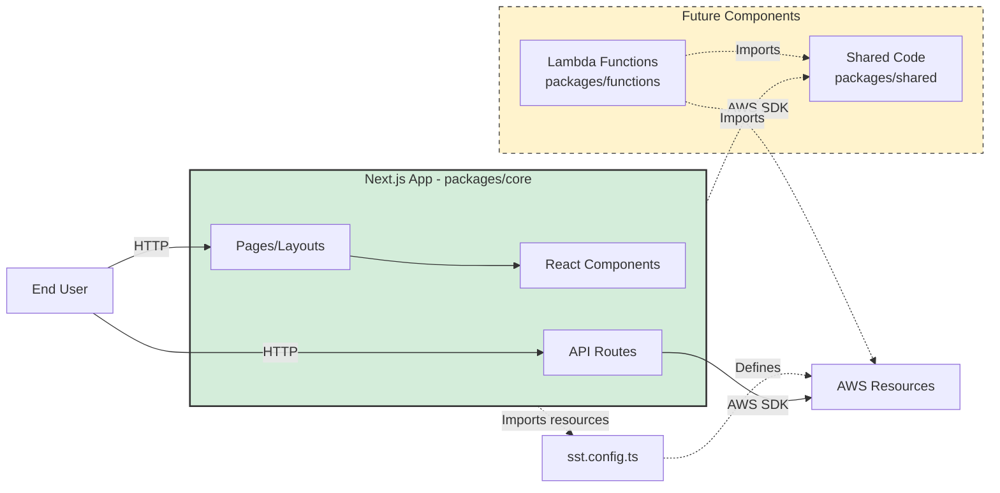

# bonstart Architecture

## System Overview

### Purpose
bonstart is a production-ready template for building serverless web applications on AWS. It provides teams with a pre-configured foundation that includes infrastructure-as-code (SST v3), modern frontend framework (Next.js 15), and a scalable monorepo structure. The template solves the "blank canvas" problem—teams can start building business logic immediately instead of spending 1-2 weeks on initial infrastructure setup, CI/CD configuration, and architectural decisions.

### Scope
**In Scope:**
- Next.js 15 application with App Router and server components
- SST v3 infrastructure-as-code configuration
- Monorepo structure with npm workspaces
- Stitch Design System integration
- Per-developer staging environments
- Basic project structure and conventions
- Documentation framework (ITDs)

**Out of Scope:**
- Authentication/authorization (teams implement based on needs)
- Database configuration (teams choose based on use case)
- CI/CD pipelines (organization-specific)
- Monitoring and alerting (application-specific)
- Business logic (template provides structure only)

### Key Stakeholders
- **Developers**: Primary users who build applications using this template
- **Teams**: Groups adopting this as their standard for new serverless projects
- **Bonterra Engineering**: Maintainers ensuring template follows best practices

## Whiteboard Diagram

```mermaid
graph TB
    Dev[Developer]
    
    subgraph system["bonstart Template (System Boundary)"]
        Core["packages/core<br/>Next.js 15 App"]
        Functions["packages/functions<br/>(Future: Lambda)"]
        Shared["packages/shared<br/>(Future: Shared code)"]
        SSTConfig["sst.config.ts<br/>Infrastructure definition"]
    end
    
    CFN[AWS CloudFormation<br/>Per-stage stacks]
    
    subgraph aws[AWS Production Environment]
        CF[CloudFront CDN]
        LambdaEdge[Lambda@Edge<br/>Next.js SSR]
        APIGW[API Gateway<br/>API Routes]
        S3[S3 Bucket<br/>Static Assets]
        LambdaFn[Lambda Functions<br/>(Future)]
        DB[(DynamoDB/RDS<br/>Future)]
    end
    
    Dev -->|npm run dev<br/>sst deploy| system
    system -->|SST CLI| CFN
    CFN -->|Provisions| aws
    
    CF --> LambdaEdge
    CF --> S3
    LambdaEdge --> APIGW
    APIGW --> LambdaFn
    LambdaFn --> DB
    
    style system fill:#f0f0f0,stroke:#333,stroke-width:3px,stroke-dasharray: 5 5
    style aws fill:#fff,stroke:#ff9900,stroke-width:2px
```

**System Boundary**: The dashed box represents what is included in the bonstart template (code, configuration). Everything outside (AWS services, CloudFormation) is provisioned/managed by SST but not part of the template itself.

## Architecture Overview

### Architecture Style
**Serverless Monolith with Monorepo Preparation**

The current architecture is a serverless monolith—the Next.js application handles both frontend rendering and API routes, deployed as Lambda functions behind CloudFront. The monorepo structure prepares for future decomposition into microservices without requiring refactoring.

### Key Characteristics
- **Infrastructure-as-Code**: All AWS resources defined declaratively in `sst.config.ts`
- **Serverless-First**: No server management, scales automatically, pay-per-use pricing
- **Monorepo Structure**: npm workspaces enable code sharing before complexity requires it
- **Per-Developer Isolation**: Each developer gets completely isolated AWS resources (via SST stages)
- **Edge-Optimized**: CloudFront CDN provides global distribution with edge rendering

### Design Philosophy
1. **Developer Experience Over Optimization**: Choose patterns that maximize velocity even if not maximally efficient
2. **Prepare for Scale, Don't Over-Engineer**: Monorepo structure supports future growth without premature decomposition
3. **Standard Patterns**: Follow SST and Next.js conventions to leverage ecosystem documentation
4. **Minimal Template Surface Area**: Provide structure and examples, not prescriptive implementations

## Component Architecture

### Core Components

#### Component: Next.js Application (packages/core)

**Responsibility**: 
- Frontend UI rendering (server-side and client-side)
- API route handlers for backend logic
- Stitch Design System integration
- Application-level routing and layouts

**Technology**: 
- Next.js 15 (App Router)
- React 19
- TypeScript 5.7
- StyleX (CSS-in-JS)
- Stitch Design System

**Key Interfaces**:
- Exposes: HTTP endpoints (pages + `/api/*` routes)
- Consumes: Stitch components, AWS SDK (for resource access)

**ITD References**: 
- [GENERAL-001: Framework Selection](01-general/GENERAL-001-framework-selection.md) - Why SST + Next.js
- [GENERAL-002: Monorepo Structure](01-general/GENERAL-002-monorepo-structure.md) - Why packages/ organization

#### Component: SST Infrastructure (sst.config.ts)

**Responsibility**:
- Define AWS resources declaratively
- Configure Next.js Lambda deployment
- Manage stage-based environments (per-developer, per-branch, shared environments)
- Provide type-safe resource references to application code

**Technology**:
- SST v3 SDK
- Pulumi (underlying infrastructure engine)
- TypeScript

**Key Interfaces**:
- Exposes: Resource objects (imported by app code)
- Consumes: AWS APIs (via SST/Pulumi)

**Stage Isolation**:
- Each stage (`--stage <name>`) creates completely separate CloudFormation stack
- No resource sharing between stages (databases, queues, Lambda functions all isolated)
- Enables: per-developer development, per-branch CI previews, multi-environment deployments

**ITD References**:
- [GENERAL-001: Framework Selection](01-general/GENERAL-001-framework-selection.md)

#### Component: packages/functions (Future)

**Responsibility**: Standalone Lambda functions for async workloads

**Use Cases**:
- Cron jobs
- Event processors (SQS, EventBridge)
- Background workers
- Data migrations

**Technology**: Node.js 22, TypeScript

**ITD References**:
- [GENERAL-002: Monorepo Structure](01-general/GENERAL-002-monorepo-structure.md) - Growth path explanation

#### Component: packages/shared (Future)

**Responsibility**: Code shared between Next.js app and Lambda functions

**Contents**:
- TypeScript types/interfaces
- Validation schemas (Zod)
- Business logic utilities
- Constants

**ITD References**:
- [GENERAL-002: Monorepo Structure](01-general/GENERAL-002-monorepo-structure.md)

### Component Interactions



**Key Interaction Patterns**:
1. **User → Next.js Pages**: Browser requests trigger server-side rendering in Lambda@Edge, returns HTML
2. **User → API Routes**: Client-side code calls `/api/*` endpoints which execute in Lambda functions
3. **Next.js → AWS Resources**: Server components and API routes use AWS SDK to access databases, queues, etc. (future)
4. **SST Config → Application**: Infrastructure resources are imported as type-safe objects (`Resource.DatabaseUrl`)

## Data Architecture

**Current State**: No database or data persistence configured. bonstart is a template—teams add data stores based on needs.

**Data Flow**:
- **Static Assets**: Next.js build → S3 → CloudFront CDN
- **Pages**: Request → Lambda@Edge renders React → HTML response
- **API Routes**: Client → `/api/*` → Lambda → (future: database) → JSON response

**ITD References**:
- Future: DATA-001 will document database choice

## APIs / Interfaces

**Next.js Pages**: Server-side rendered HTML (Lambda@Edge)

**API Routes**: `/api/*` endpoints (Lambda functions)
- Examples: `/api/health`, `/api/hello`
- Returns JSON
- No authentication configured (teams implement)

**External Integrations**: None in template (teams add auth providers, databases, etc.)

## Deployment Architecture

**Cloud Provider**: AWS (SST requirement)

**AWS Services Provisioned**:
- CloudFront (CDN) + Lambda@Edge (Next.js SSR)
- Lambda (API routes)
- S3 (static assets)
- CloudFormation (infrastructure management)

**Deployment**: `sst deploy --stage <stage-name>`

**Environments**:

| Environment | Stage Name | Purpose |
|-------------|------------|---------|
| Personal dev | `<your-name>` | Individual development (`sst dev`) |
| Per-branch | `pr-<number>` | CI preview environments |
| Shared | `dev`, `staging`, `prod` | Team environments |

**Key Characteristic**: Each stage creates completely isolated AWS stack—no resource sharing between developers or branches.

**ITD References**:
- [GENERAL-001: Framework Selection](01-general/GENERAL-001-framework-selection.md)

## Key Technical Decisions

### GENERAL-001: SST v3 + Next.js Framework Selection

**Decision**: Use SST v3 for infrastructure and Next.js 15 for application framework

**Why**: SST provides infrastructure-as-code at the right abstraction level—easier than CDK but more flexible than Amplify. Next.js is the industry-standard React framework with excellent SST integration. Together they minimize initial setup time while supporting complex applications.

**Trade-offs**:
- **Gained**: Rapid development, type-safe infrastructure, large ecosystem
- **Sacrificed**: Vendor lock-in to AWS, cold start latency vs. traditional servers

→ **Full Details**: [GENERAL-001: Framework Selection](01-general/GENERAL-001-framework-selection.md)

### GENERAL-002: Monorepo Structure

**Decision**: Use npm workspaces with `packages/` directory from day one

**Why**: Serverless projects inevitably need standalone Lambda functions and shared code between frontend and backend. Starting with monorepo structure avoids painful refactoring when first Lambda function or shared library is needed (typically within first month of development).

**Trade-offs**:
- **Gained**: No refactoring needed when adding functions/shared code, follows SST conventions
- **Sacrificed**: One extra directory level vs. flat structure

→ **Full Details**: [GENERAL-002: Monorepo Structure](01-general/GENERAL-002-monorepo-structure.md)

## Constraints & Trade-offs

**Technical Constraints**:
- AWS-only (SST limitation)
- Lambda cold starts (~500ms-1s first request)
- Node.js runtime only in template

**Business Constraints**:
- Must use Stitch Design System (Bonterra standard)
- Must use TypeScript (Bonterra policy)
- Must use Node 22 LTS (Bonterra policy)

**Conscious Trade-offs**:
- Serverless simplicity over raw performance
- Monolith first, microservices later (see GENERAL-002)
- Template provides structure, not complete solutions (teams add auth, DB, etc.)

**Open Questions** (need ITDs):
- AUTH-001: Authentication strategy
- DATA-001: Database choice and patterns
- API-001: REST API conventions

## References

### Documentation
- [Main README](../../README.md) - User-facing documentation
- [Docs README](../README.md) - Documentation guidelines
- [ITD Template](../templates/itd-template.md) - How to document decisions

### Related ITDs
- [GENERAL-001: Framework Selection](01-general/GENERAL-001-framework-selection.md)
- [GENERAL-002: Monorepo Structure](01-general/GENERAL-002-monorepo-structure.md)

### Code Repositories
- bonstart: Main template repository (current)
- Stitch Design System: Internal Bonterra component library

### External Resources
- [SST v3 Documentation](https://sst.dev/)
- [Next.js 15 Documentation](https://nextjs.org/docs)
- [AWS Lambda Pricing](https://aws.amazon.com/lambda/pricing/)
- [AWS Well-Architected Framework](https://aws.amazon.com/architecture/well-architected/)
