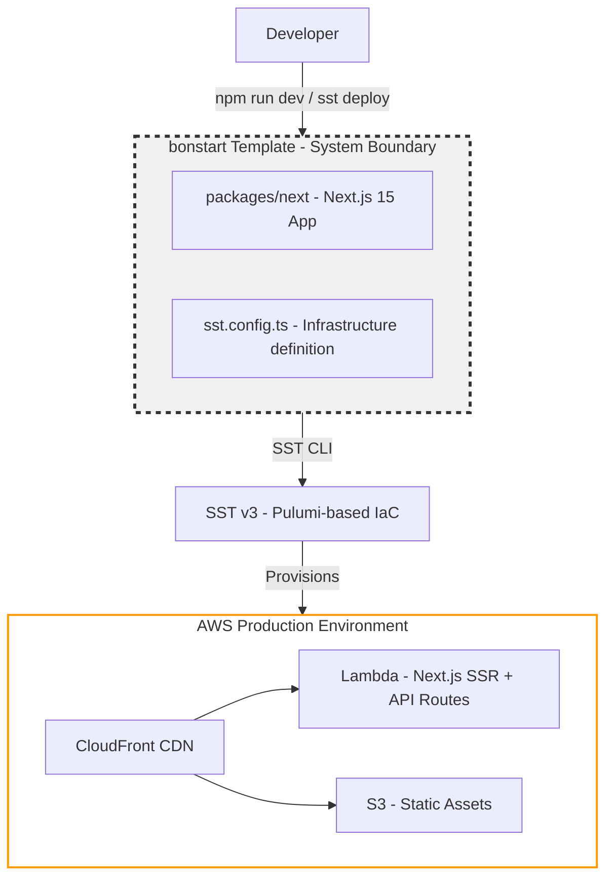

# bonstart Architecture

## System Overview

**Purpose**: bonstart is a production-ready template for building serverless web applications on AWS. It provides teams with a pre-configured foundation that includes infrastructure-as-code (SST v3), modern frontend framework (Next.js 15), and a scalable monorepo structure. The template solves the "blank canvas" problem—teams can start building business logic immediately instead of spending 1-2 weeks on initial infrastructure setup, CI/CD configuration, and architectural decisions.

**Key Stakeholders**:

- **Developers**: Primary users who build applications using this template
- **Teams**: Groups adopting this as their standard for new serverless projects
- **Bonterra Engineering**: Maintainers ensuring template follows best practices

**Constraints & Trade-offs**:

- AWS-only
- Lambda cold starts (~500ms-1s first request)
- Must use Stitch Design System
- Must use TypeScript and Node 22
- Highly opinionated stack (SST + Next.js + Stitch + GitHub Actions)
- Continuous deployment with scheduled hourly promotions to long-lived environments
- Serverless simplicity over raw performance

## Whiteboard Diagram

**System Boundary**: The dashed box represents what the bonstart template includes (code, configuration). Everything outside (AWS services, SST/Pulumi) is managed by SST but not part of the template itself.

## Architecture Overview

**Style**: Serverless monolith with monorepo preparation

The current architecture is a serverless monolith—the Next.js application handles both frontend rendering and API routes, deployed as Lambda functions behind CloudFront. The monorepo structure prepares for future decomposition without requiring refactoring.

**Key Characteristics**:

- **Infrastructure-as-Code**: All AWS resources defined declaratively in `sst.config.ts`
- **Serverless-First**: No server management, scales automatically, pay-per-use pricing
- **Per-Developer Isolation**: Each developer gets completely isolated AWS resources (via SST stages)
- **Edge-Optimized**: CloudFront CDN provides global distribution

## Key Technical Decisions

**SST v3 + Next.js**: We compared five frameworks and chose SST + Next.js to ship faster without sacrificing flexibility → [GENERAL-001](01-general/GENERAL-001-framework-selection.md)

**Monorepo from Day One**: Starting with packages/ structure avoids painful refactoring when you inevitably need standalone Lambda functions → [GENERAL-002](01-general/GENERAL-002-monorepo-structure.md)

## Data & State Management

**Current State**: No database or persistent state configured. bonstart is a template—teams add data stores based on needs.

**Data Stores**: None in template

**Data Flow**:

- **Static Assets**: Next.js build → S3 → CloudFront CDN
- **Pages**: Request → Lambda renders React → HTML response
- **API Routes**: Client → `/api/*` → Lambda → JSON response

## Components

The system consists of three main components:

1. Next.js Application - Frontend and API routes
2. SST Infrastructure - AWS resource definitions
3. GitHub Actions CI/CD - Deployment automation

### Component 1: Next.js Application

The main application handles frontend rendering and API routes. Built with Next.js 15, React 19, and Stitch Design System. Deploys as Lambda functions with CloudFront CDN.

**Related Decisions**: We chose SST + Next.js to minimize setup time while supporting complex applications → [GENERAL-001](01-general/GENERAL-001-framework-selection.md)

### Component 2: SST Infrastructure

Defines all AWS resources declaratively in `sst.config.ts`. SST v3 uses Pulumi under the hood for infrastructure provisioning. Each stage (`--stage <name>`) creates a completely isolated stack—enabling per-developer sandboxes, per-branch previews, and multi-environment deployments.

**Related Decisions**: Monorepo structure prepares for standalone Lambda functions without painful refactoring → [GENERAL-002](01-general/GENERAL-002-monorepo-structure.md)

### Component 3: GitHub Actions CI/CD

Automated deployment workflows handle the full lifecycle:

- **Deploy workflow**: Every push triggers deployment (`main` → production, `develop` → develop env, feature branches → ephemeral envs)
- **Pre-deployment checks**: Linting, Prettier, and TypeScript validation
- **Environment cleanup**: Ephemeral environments auto-delete when branches close
- **Stage locking**: Prevents deployment conflicts
- **AWS OIDC auth**: No long-lived credentials (uses GitHub's OIDC provider for temporary credentials)

**Environments:**

| Environment | Stage Name | Purpose |
|-------------|------------|---------|
| Personal dev | `<your-name>` | Individual development (`sst dev`) |
| Per-branch | `pr-<number>` | CI preview environments |
| Shared | `dev`, `staging`, `prod` | Team environments |

**Key Interactions**:

1. **User → Next.js Pages**: Browser requests trigger server-side rendering in Lambda, returns HTML
2. **User → API Routes**: Client-side code calls `/api/*` endpoints which execute in Lambda
3. **SST Config → Application**: The app imports infrastructure resources as type-safe objects

## APIs / Interfaces

**Next.js Pages**: Server-side rendered HTML

**API Routes**: `/api/*` endpoints returning JSON

**External Integrations**: None in template
