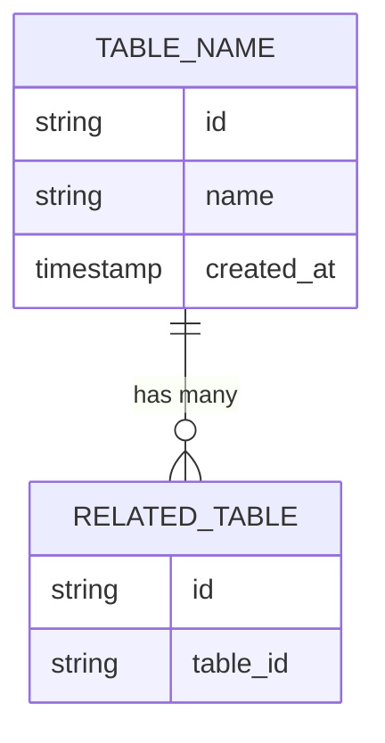

# DS-XXX: [Data Structure Name]

*Author: [Your Name] | Reviewers: [Names] | Status: [draft/approved/implemented]*

## Overview

[Brief description of what this data structure represents and its purpose in the system]

**Architecture**: [High-level description of the design approach]

**Key Architectural Decisions**: [Link to related ITDs that affect this structure]

## Architectural Decisions

### DS-ITD-01: [Key Design Decision]

**CONTEXT**: [Background for this specific design choice]

**THE PROBLEM**: [What question does this decision answer?]

**OPTIONS CONSIDERED**:

1. **[Option 1]** (Selected)
2. [Option 2]
3. [Option 3]

**REASONING**:

- Why option 1 was selected
- Why other options were rejected
- Performance/scale considerations

## Entity Relationship Model



## Data Structure Schema

### Primary Schema

```typescript
interface YourDataStructure {
  // Primary keys
  id: string;                    // Primary key
  
  // Core fields
  name: string;
  status: 'active' | 'inactive';
  
  // Timestamps
  createdAt: string;             // ISO8601 timestamp
  updatedAt: string;             // ISO8601 timestamp
  
  // Optional fields
  metadata?: Record<string, unknown>;
}
```

### Indexes (if using DynamoDB/similar)

| Field | Type | Purpose |
|-------|------|---------|
| **Primary Key** | string | Main access pattern |
| **Sort Key** | string | Secondary ordering |
| **GSI-1** | string | Alternative query pattern |

## CRUD Operations

### Create

**When**: [Describe when records are created]

**Implementation:**

```typescript
async function createRecord(data: Partial<YourDataStructure>): Promise<YourDataStructure> {
  const record: YourDataStructure = {
    id: generateId(),
    createdAt: new Date().toISOString(),
    updatedAt: new Date().toISOString(),
    ...data
  };
  
  await db.put(record);
  return record;
}
```

### Read

**Access Patterns:**

- [Pattern 1]: Query by X
- [Pattern 2]: Filter by Y
- [Pattern 3]: Time-based access

**Query Examples:**

```typescript
// Get by ID
const record = await db.get({ id: 'xxx' });

// Query with filters
const records = await db.query({
  where: { status: 'active' },
  orderBy: { createdAt: 'desc' }
});
```

### Update

**Update Strategy:**

- [Describe update approach - full replacement, partial updates, immutable, etc.]

**Implementation:**

```typescript
async function updateRecord(id: string, updates: Partial<YourDataStructure>): Promise<void> {
  await db.update({
    id,
    ...updates,
    updatedAt: new Date().toISOString()
  });
}
```

### Delete

**Deletion Strategy:**

- [Hard delete, soft delete, TTL-based, etc.]
- [Retention period if applicable]

## Query Patterns

### Common Queries

```typescript
// [Describe common query 1]
const results = await db.query({
  // Query details
});

// [Describe common query 2]
const results = await db.query({
  // Query details
});
```

### Performance Characteristics

- **Read latency**: [Expected latency]
- **Write throughput**: [Expected throughput]
- **Storage**: [Expected storage per record]
- **Scale considerations**: [What to watch for at scale]

## Implementation Guidance

### Integration Example

```typescript
// [Show how other parts of the system interact with this data structure]
class YourService {
  async performOperation(id: string): Promise<void> {
    const record = await db.get({ id });
    // ... business logic
    await db.update(record);
  }
}
```

### Best Practices

- [Best practice 1]
- [Best practice 2]
- [Common pitfalls to avoid]

## Monitoring and Observability

### Key Metrics

- [Metric 1]: [What to measure]
- [Metric 2]: [What to measure]

### Alerting Thresholds

- [Alert 1]: [When to alert]
- [Alert 2]: [When to alert]

## Related Documentation

- [Related ITD-XXX]
- [Related DS-XXX]
- [External documentation]
